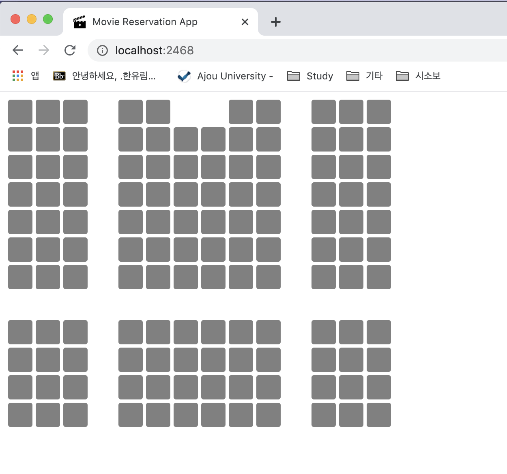
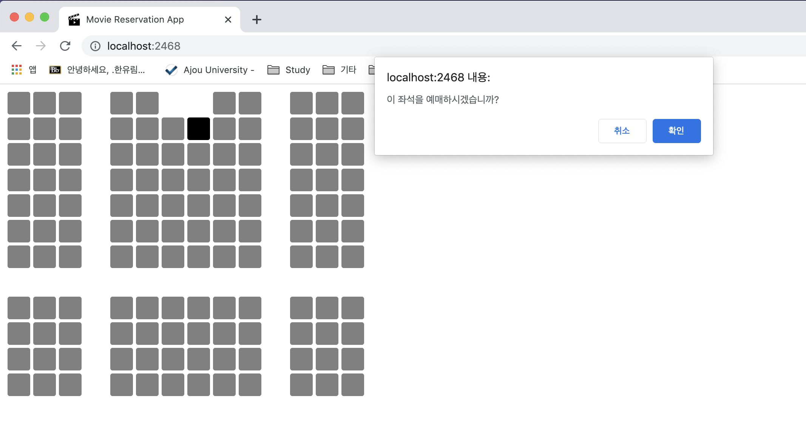
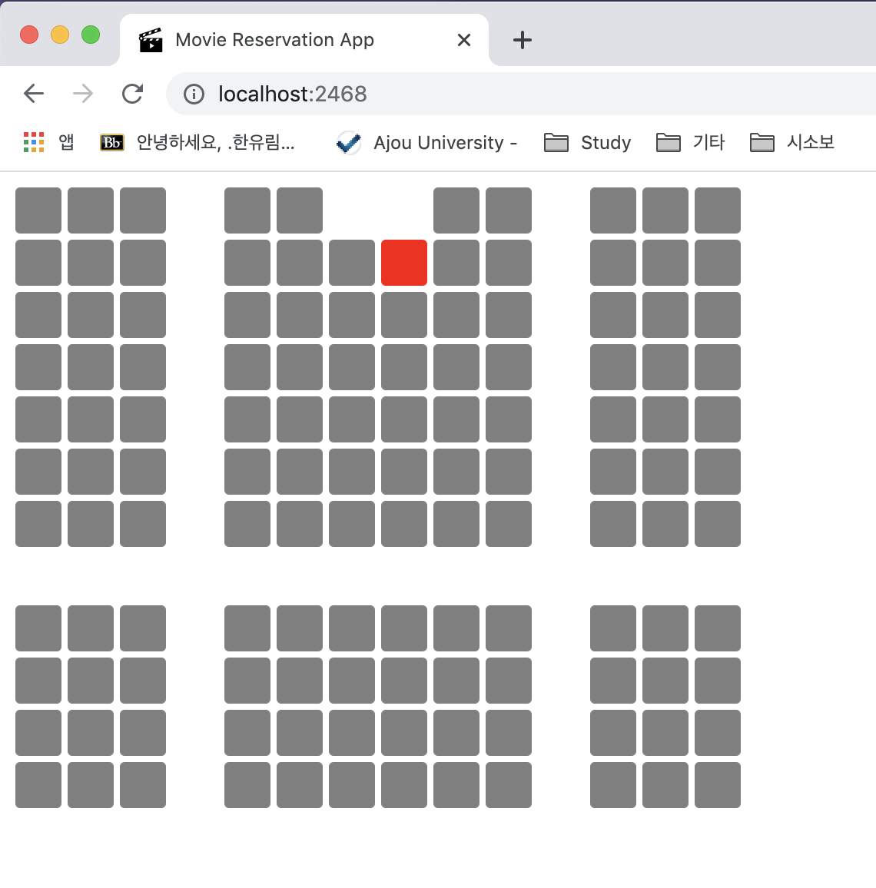

실시간 영화 예매 애플리케이션
---
### 사용한 시스템
* Node.js, Express, Socket.io
* 라이브러리 : JQuery Ajax

### 사용 예시

> 메인 화면

> 예약할 좌석을 선택하면 다음과 같은 안내문이 뜸.

> 좌석 예약이 완료되면 빨간색으로 표시.

### 더 구현해야 할 사항
* 예약 취소 기능
* 한꺼번에 여러 명 예약할 수 있는 기능
* 영화, 날짜 선택